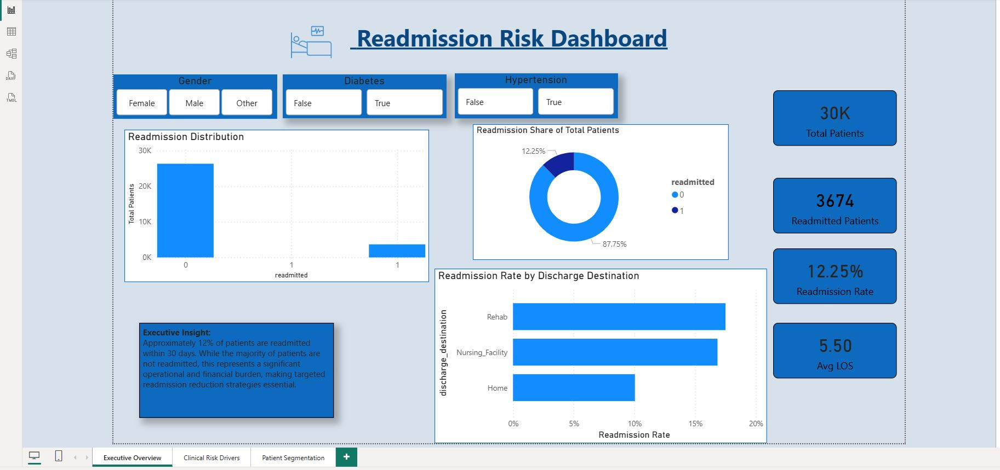
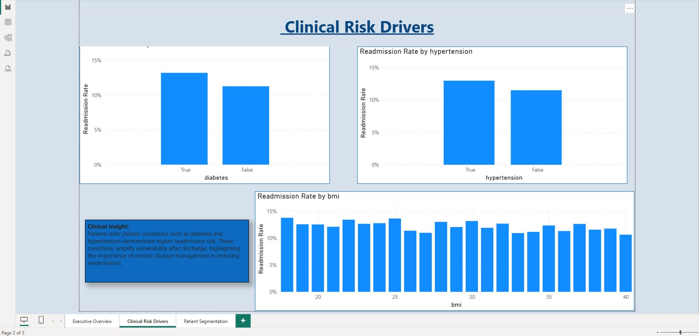
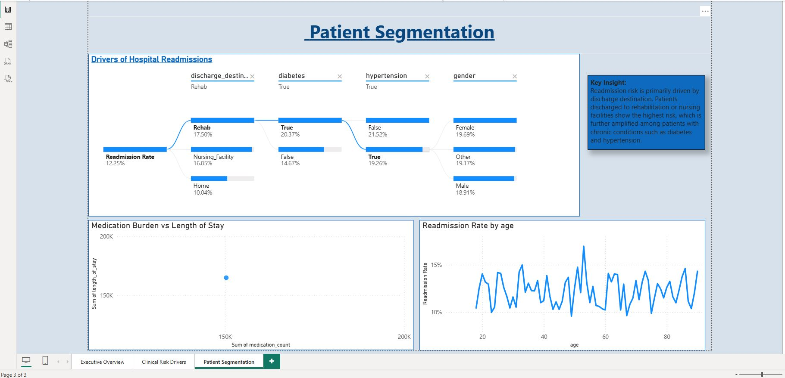

# Hospital Readmission Risk Analysis

## Overview
This project analyzes 30-day hospital readmissions using SQL and Python to identify key clinical and operational risk drivers.

## Dataset
- Source: Kaggle – Hospital Readmission Prediction
- Size: 30,000 patient records
- Target variable: 30-day readmission

## Tools & Technologies
- Python (Pandas, Matplotlib, Seaborn)
- SQL Server
- Power BI (dashboarding)

## Key Findings
- Overall readmission rate: **12.25%**
- Length of stay is not a strong predictor of readmission
- Discharge destination is the primary risk driver
  - Rehab: 17.5%
  - Nursing Facility: 16.85%
  - Home: 10.04%

## Visual Outputs
All exploratory analysis visuals are saved in the `outputs/` folder:
- Readmission distribution
- Readmission rate by discharge destination
- Readmission rate by diabetes status

## SQL Exploratory Data Analysis
SQL Server was used to validate key findings and support dashboard metrics. 
Queries focused on readmission rates, length of stay comparisons, discharge destination risk, and clinical condition impacts.

## Power BI Dashboard

This project includes an interactive Power BI dashboard analyzing hospital readmission risk using clinical and operational data.  
The dashboard is structured into three focused pages.

---

### 🔹 Page 1: Executive Overview – Readmission Risk

**Highlights**
- Overall readmission rate: **12.25%**
- Highest risk observed for patients discharged to **Rehab** and **Nursing Facilities**
- Readmissions represent a significant operational and care-quality concern

**Visuals**
- KPI cards (Total Patients, Readmission Rate, Avg LOS)
- Readmission distribution
- Readmission share (donut)
- Readmission rate by discharge destination
- Interactive slicers (Gender, Diabetes, Hypertension)

---

### 🔹 Page 2: Clinical Risk Drivers

**Highlights**
- Patients with **diabetes** and **hypertension** show higher readmission rates
- Chronic conditions increase post-discharge vulnerability
- BMI shows moderate variation but weaker predictive power

**Visuals**
- Readmission rate by diabetes
- Readmission rate by hypertension
- Readmission rate by BMI

---

### 🔹 Page 3: Patient Segmentation & Root Cause Analysis

**Highlights**
- **Discharge destination** is the strongest driver of readmission risk
- Risk increases further when combined with chronic conditions
- Decomposition tree reveals how factors interact

**Visuals**
- Decomposition Tree (Readmission Rate → Discharge Destination → Diabetes → Hypertension → Gender)
- Medication burden vs length of stay
- Readmission rate by age

---

## Key Takeaway
This dashboard demonstrates end-to-end analytics capability using **SQL, Python, and Power BI**, with a focus on healthcare insights, risk identification, and data-driven storytelling.
